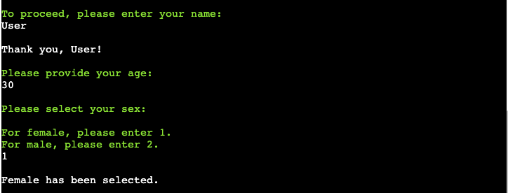
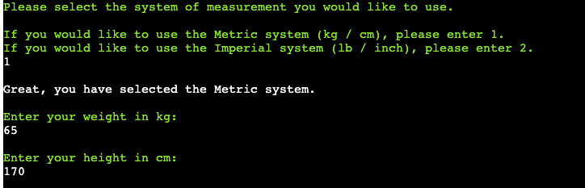
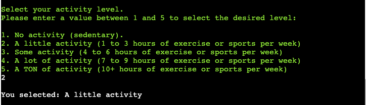
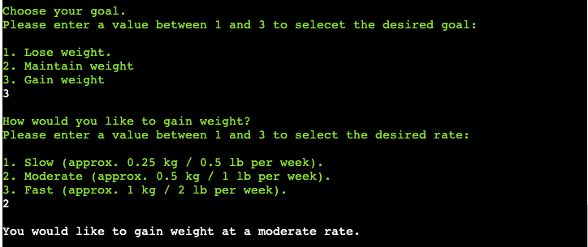
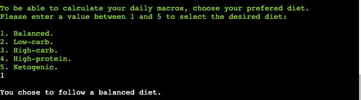
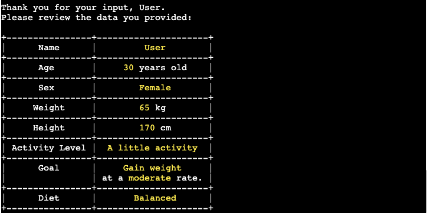
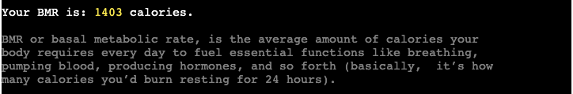
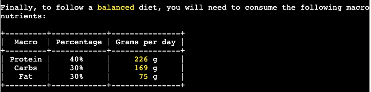
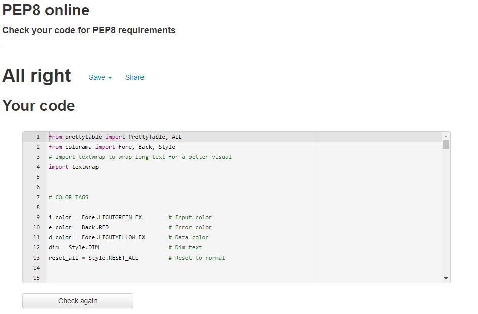

# Macro Calculator

Macro Calulator is designed to help the users discover how much of each macronutrient they should eat every day to reach the desire goal.

There are three principal classes of macronutrients: carbohydrate, protein, and fat. Balancing these nutrients is a crucial element of success to any workout goal, whether looking to build muscle, lose fat, or improve athletic performance.

## Table of Contents
1. [User Experience (UX)](#user-experience-UX)
    1. [Project Goals](#project-goals)
    2. [User Stories](#user-stories)
    3. [Color Scheme](#color-scheme)
    4. [Data Model](#data-model)
    5. [Flowchart](#flowchart)
2. [Features](#features)
    1. [User Information Input](#user-information-input)
    2. [System of Measurement Selection](#system-of-measurement-selection)
    3. [Activity Level Selection](#activity-level-selection)
    4. [Goal Selection](#goal-selection)
    5. [Diet Selection](#diet-selection)
    6. [Review Data](#review-data)
    7. [BMR Calculator](#bmr-calculator)
    8. [TDEE Calculator](#tdee-calculator)
    9. [Calories Goal Calculator](#calories-goal-calculator)
    10. [Macronutrients Calculator](#macronutrients-calculator)
    11. [Restart Program](#restart-program)
3. [Technologies Used](#technologies-used)
    1. [Language Used](#language-used)
    2. [Frameworks, Libraries and Programs Used](#frameworks-libraries-and-programs-used)
4. [Testing](#testing)
    1. [Testing User Stories](#testing-user-stories)
    2. [Code Validation](#code-validation)
5. [Deployment](#deployment)
6. [Credits](#credits)
7. [Acknowledgements](#acknowledgements)

***

## User Experience (UX)

### Project Goals

* Display enough information about the calculator in order to make it easy to understand even for first time users.

* Each step provides the necessary information to make the program clear and intuitive.

* Provides input validation to help the user input the correct data.

* The program should keep running until the user decides otherwise.

### User Stories

* As a user, I want to receive information about the main objective of the program.

* As a user, I want to easily understand what input is needed on each step.

* As a user, I want to receive clear feedback in case I provide the wrong input.

* As a user, I want to be able to review the data I provided and correct it if needed.

* As a user, I want the calculations to be displayed in a clear way and to be easy to understand.

### Color Scheme

[Colorama](https://pypi.org/project/colorama/) has been used to apply color to the terminal text. This in order to make the program more intuitive and easier to read. 

Here are the colors being used:

* Inputs are displayed in light green.

* Data and the main logo is displayed in light yellow.

* Errors are displayed with a red background.

* Some extra information has been displayed in dim text.

* Messages are displayed in the default terminal color.

### Data Model

Simple data as the name, age, weight and height are being returned and stored as variables in order to access them in the future to display the data back to the user or to make calculations.

The unit selector returns 1 or 2 to be able to use them in if statements to choose different paths in the logic.

More complex data as the gender, activity level, user's goal and diet is being stored as dictionaries as they contain a description of the selection to display back to the user, but also contain values to use in the different calculations.

Calculations are stored as variables to be able to format them and display them back to the user.

### Flowchart

The following flowchart was designed using [Miro](https://miro.com/) in order to plan the logic to be implemented in the program.

As shown in the flowchart, the original order of some functions has been changed during the development process in to follow a more intuitive logic and sequence of events but the main idea behind the process is still the same.

[Back to top ⇧](#macro-calculator)

## Features

### User Information Input

Collect the users information in order to use it in the program.

Due to the biological characteristics needed for the BMR calculation, sex has been used over gender.

### System of Measurement Selection

Allow the users to select the System of Measurement they are more confortable with.

### Activity Level Selection

Allow the users to select their activity level in order to calculate the total daily energy expenditure (TDEE) based on this activity level.

### Goal Selection

Allow the users to select their desired goal . The program will then use this goal to calculate the total daily calories and the macronutrients split based on this goal.

### Diet Selection

Allow the users to select thier prefered diet. This diet will dictate the split of the macronutrients.

### Review Data

Allow the users to review the data input and give them the possibility to enter the data again if a mistake has been made.

### BMR Calculator

The program use the [Mifflin-St Jeor formula](https://pubmed.ncbi.nlm.nih.gov/2305711/) to calculate the user's basal metabolic rate (BMR) using the input provided.

**Mifflin-St Jeor Formula**

*Male BMR* = [9.99 x weight (kg)] + [6.25 x height (cm)] – [4.92 x age (years)] + 5

*Female BMR* = [9.99 x weight (kg)] + [6.25 x height (cm)] – [4.92 x age (years)] – 161

### TDEE Calculator

The program use the the value of the selected activity level multiplied by the BMR to calculate the user's total daily energy expenditure (TDEE)..

Activity Level | Value
---|---
No activity: | 1.2
A little activity: | 1.375
Some activity: | 1.55
A lot of activity: | 1.725
A TON of activity: | 1.9

### Calories Goal Calculator

Calculate the total daily calories to be consumed by using the value of the selected goal multiplied by the TDEE.

**Lose Weight**

Rate | Value
--- | ---
Slow | 0.91
Moderate | 0.82
Fast | 0.65

**Maintain Weight**

Keeps the same TDEE value.

**Gain Weight**

Rate | Value
--- | ---
Slow | 1.08
Moderate | 1.17
Fast | 1.34

### Macronutrients Calculator

Use the macronutrient split returned when the diet is selected in order to calculate the macronutrients in grams to be consumed every day.

**Macronutrients Split Percentage**

Diet | Protein | Carbs | Fat
--- | ---| --- | ---
Balanced | 40% | 30% | 30%
Low-carb | 40% | 20% | 40%
High-carb | 30% | 50% | 20%
High-protein | 40% | 20% | 40%
Ketogenic | 40% | 10% | 50%

### Restart Program

Allow the user to keep running or exit the program.

### Future Features

**Custom Macronutrients Split**

The developer is planning to implement the possibility to input custom macronutrients split when selecting the diet. This will be done by selecting a custom diet and then entering a percentage for each macronutrient (protein, carbs and fat).

It was decided not to implement this feature at this point as it became bit confusing for the user. Once this feature is implemented it will need to be very intuitive to use.

[Back to top ⇧](#macro-calculator)

## Technologies Used

### Language Used

* [Python3](https://en.wikipedia.org/wiki/Python_(programming_language))

### Frameworks, Libraries and Programs Used

* [GitPod](https://gitpod.io/) was used for writing code, committing, and then pushing to GitHub.

* [GitHub](https://github.com/) was used to store the project after pushing.

* [Heroku](https://id.heroku.com/) was used to deploy the application.

* [PEP8 online check](http://pep8online.com/) was used to validate the Python code.

* [PrettyTable](https://pypi.org/project/prettytable/) library was used to present the data in table format.

* [Colorama](https://pypi.org/project/colorama/) library was used to apply color to the terminal text. 

* [Miro](https://miro.com/) was used to create the program flowchart.

[Back to top ⇧](#macro-calculator)

## Testing

### Testing User Stories

* As a user, I want to receive information about the main objective of the program.

    - Information about the program is presented in the welcome message explaining the use of the application.

    - Details are provided together with the results to further explain the different terms.

* As a user, I want to easily understand what input is needed on each step.

    - Input messages are being provided with detailed information on what the input needs to be.

    - Input messages text is colored in light green to make them noticeable.

* As a user, I want to receive clear feedback in case I provide the wrong input.

    - Error messages are provided explaining what is wrong with the input provided in case the wrong input is entered.

    - Some values as age, weight and height are being limited in order to gather the correct information and avoid mistypes.

    - Error messages have a red background to make them noticeable.

* As a user, I want to be able to review the data I provided and correct it if needed.

    - Added a feature where the user can easily see the data entered and decide to continue or enter the data again.

    - The data is being presented in table format to make it easier to review.

    - The input data is colored in light yellow to make it as clear as possible.

* As a user, I want the calculations to be displayed in a clear way and to be easy to understand.

    - Calculations are being formatted and presented at the end of the program with explanation for the different results.

    - The result data is colored in light yellow to make it as clear as possible.

### Code Validation

[PEP8 online check](http://pep8online.com/) was used to validate the Python code for PEP8 requirements.

[Back to top ⇧](#macro-calculator)

## Deployment

The application has been deployed using [Heroku](https://id.heroku.com/) by following these steps:

[Heroku](https://id.heroku.com/) was used to deploy the application.

1. Create the requirements.txt file and run: `pip3 freeze > requirements.txt` in the console.
2. Commit changes and push them to GitHub.
3. Go to the Heroku's website.
4. From the Heroku dashboard, click on "Create new app".
5. Enter the "App name" and "Choose a region" before clicking on "Create app".
6. Go to "Config Vars" under the "Settings" tab.
7. Click on "Reveals Config Vars" and add the KEY: CREDS and the VALUE stored in creds.json file if needed.
8. Add the Config Var, KEY: PORT and VALUE: 8000.
9. Go to "Buildpacks" section and click "Add buildpack".
10. Select "python" and click "Save changes"
11. Add "nodejs" buildpack as well using the same process.
12. Go to "Deployment method", under the "Deploy" tab select "GitHub" and click on "Connect to GitHub".
13. Go to "Connect to GitHub" section and "Search" the repository to be deployed.
14. Click "Connect" next the repository name.
15. Choose "Automatic deploys" or "Manual deploys" to deploy your application.

[Back to top ⇧](#macro-calculator)

## Credits

## Acknowledgements