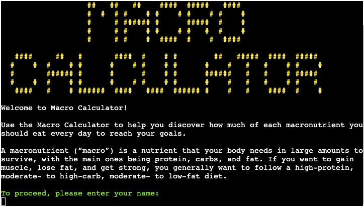
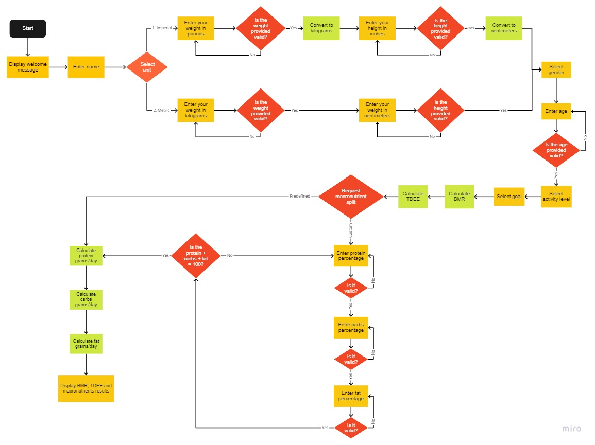

# Macro Calculator

Macro Calulator is designed to help the users discover how much of each macronutrient they should eat every day to reach the desire goal.

There are three principal classes of macronutrients: carbohydrate, protein, and fat. Balancing these nutrients is a crucial element of success to any workout goal, whether looking to build muscle, lose fat, or improve athletic performance.

## Table of Contents
1. [User Experience (UX)](#user-experience-UX)
    1. [Project Goals](#project-goals)
    2. [User Stories](#user-stories)
    3. [Color Scheme](#color-scheme)
    4. [Data Model](#data-model)
    5. [Flowchart](#flowchart)
2. [Features](#features)
3. [Data Model](#data-model)
4. [Technologies Used](#technologies-used)
5. [Testing](#testing)
6. [Deployment](#deployment)
7. [Credits](#credits)
8. [Acknowledgements](#acknowledgements)

***

## User Experience (UX)

### Project Goals

* Display enough information about the calculator in order to make it easy to understand even for first time users.

* Each step provides the necessary information to make the program clear and intuitive.

* Provides input validation to help the user input the correct data.

* The program should keep running until the user decides otherwise.

### User Stories

* As a user, I want to receive information about the main objective of the program.

* As a user, I want to easily understand what input is needed on each step.

* As a user, I want to receive clear feedback in case I provide the wrong input.

* As a user, I want to be able to review the data I provided and correct it if needed.

* As a user, I want the calculations to be displayed in a clear way and to be easy to understand.

### Color Scheme

Colorama has been used to apply color to the terminal text. This in order to make the program more intuitive and easier to read. 

Here are the colors being used:

* Inputs are displayed in light green.

* Data and the main logo is displayed in light yellow.

* Errors are displayed with a red background.

* Some extra information has been displayed in dim text.

* Messages are displayed in the default terminal color.

### Data Model

Simple data as the name, age, weight and height are being returned and stored as variables in order to access them in the future to display the data back to the user or to make calculations.

The unit selector returns 1 or 2 to be able to use them in if statements to choose different paths in the logic.

More complex data as the gender, activity level, user's goal and diet is being stored as dictionaries as they contain a description of the selection to display back to the user, but also contain values to use in the different calculations.

Calculations are stored as variables to be able to format them and display them back to the user.

### Flowchart

The following flowchart was designed using [Miro](https://miro.com/) in order to plan the logic to be implemented in the program.

As shown in the flowchart, the original order of some functions has been changed during the development process in to follow a more intuitive logic and sequence of events but the main idea behind the process is still the same.

[Back to top ⇧](#macro-calculator)

## Features

## Technologies Used

## Testing

## Deployment

## Credits

## Acknowledgements